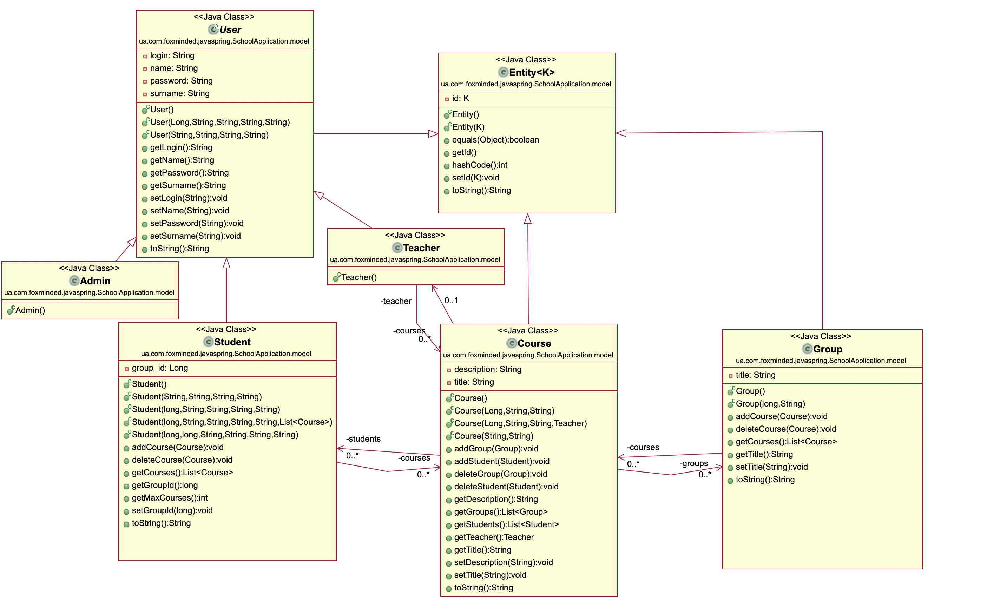
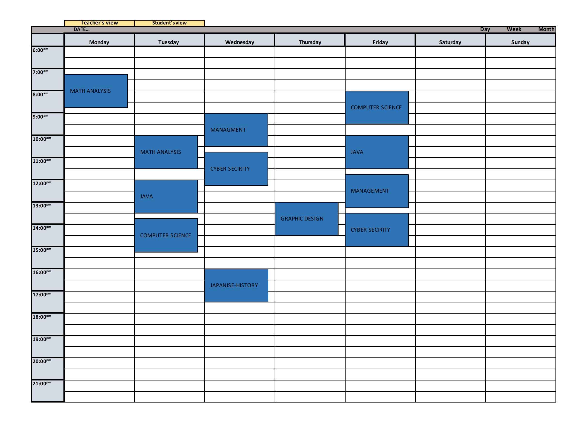

### 📌 University application, can be used as a universal platform for students
- **Description:** This application allows you to log in as a student, teacher, or admin. Each role has a specific functionality. Students can see schedules, marks, their teachers, enroll in courses, and join groups. Teachers can see their schedule, groups and give marks. Admins can assign roles, delete, create, update, etc. 
- **Technologies:** Java, Spring(Data, Security, Web), Hibernate, Flyway, Auth0, Maven, Mockito, JUnit, PostgreSQL, H2, HTML, CSS.

 

### User Stories :bookmark_tabs:  

**Teacher Schedule**
 * User Story 1: View Teacher Schedule
Scenario: Teacher can view their schedule

-Given the user is logged in as a Teacher

When the user navigates to the application  
Then the user should see a My Schedule menu  

-Given the user is on the My Schedule page

When the user selects a date or range filter  
Then the user should see their own Teacher schedule according to the selected date/range filter

 * User Story 2: Navigate Teacher Schedule
Scenario: Teacher can navigate through their schedule

-Given the user is on the My Schedule page

When the user navigates to different dates or adjusts the range filter  
Then the user's Teacher schedule should dynamically update based on the selected date/range filter  

 

**Student Schedule**
 * User Story 3: Manage Student Schedule
Scenario: Student can manage their schedule

-Given the user is logged in as a Student

When the student navigates to the application  
Then the student should see a My Schedule menu  

-Given the user is on the My Schedule page

When the student selects a date or range filter  
Then the student should see their own group and schedule according to the selected date/range filter  

 * User Story 4: Enroll in a New Course
Scenario: Student can enroll in a new course

-Given the user is on the Courses page

When the student finds a course they want to take  
And there are available slots in the course  
And the student has not reached the maximum number of courses  
Then the student can enroll in the course  

 * User Story 5: Unenroll from a Course
 
Scenario: Student can unenroll from a course

-Given the user is on the My Schedule page

When the student views their enrolled courses  
And the student selects a course to unenroll  
Then the student should be removed from the course schedule  
And the course slots should be available for other students.  

 

<!--### Here's the schedule plan :calendar:

<!--   -->

<!--### ...
<!--...
